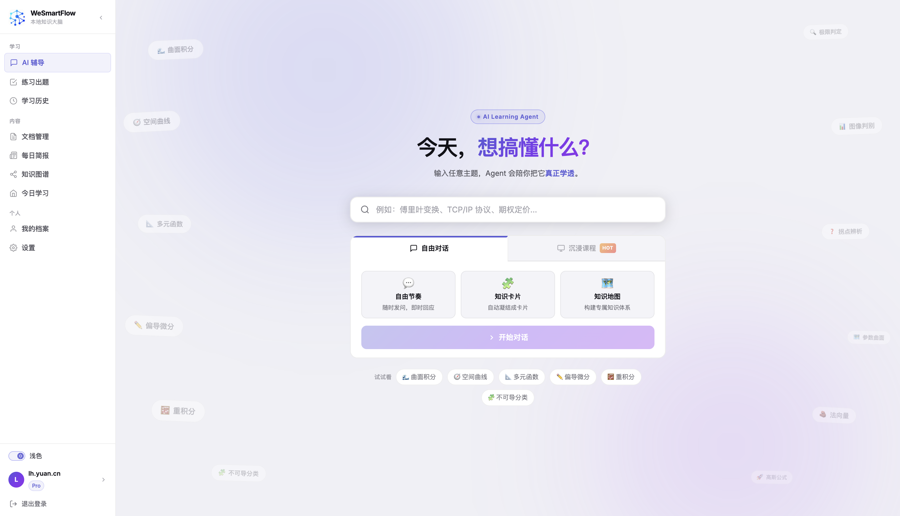
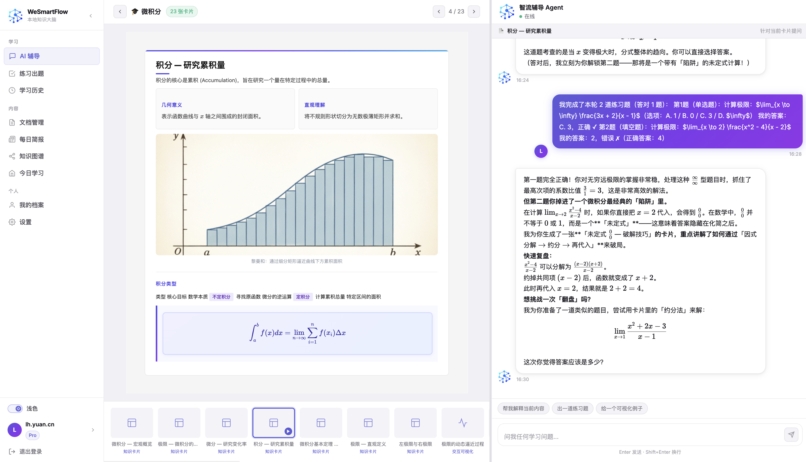
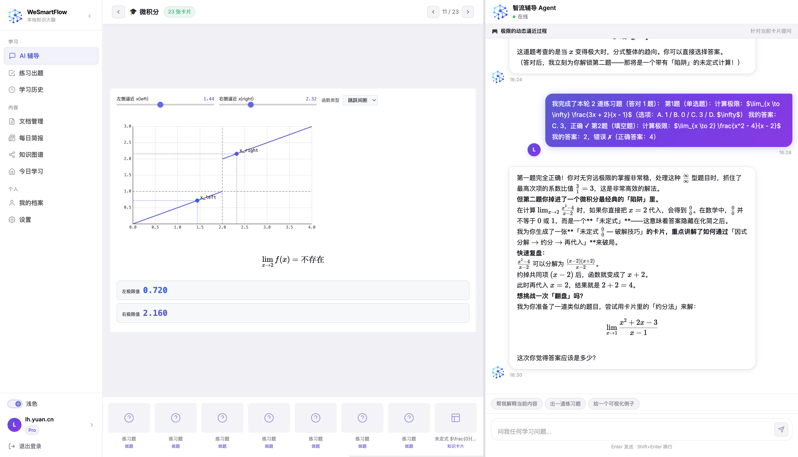
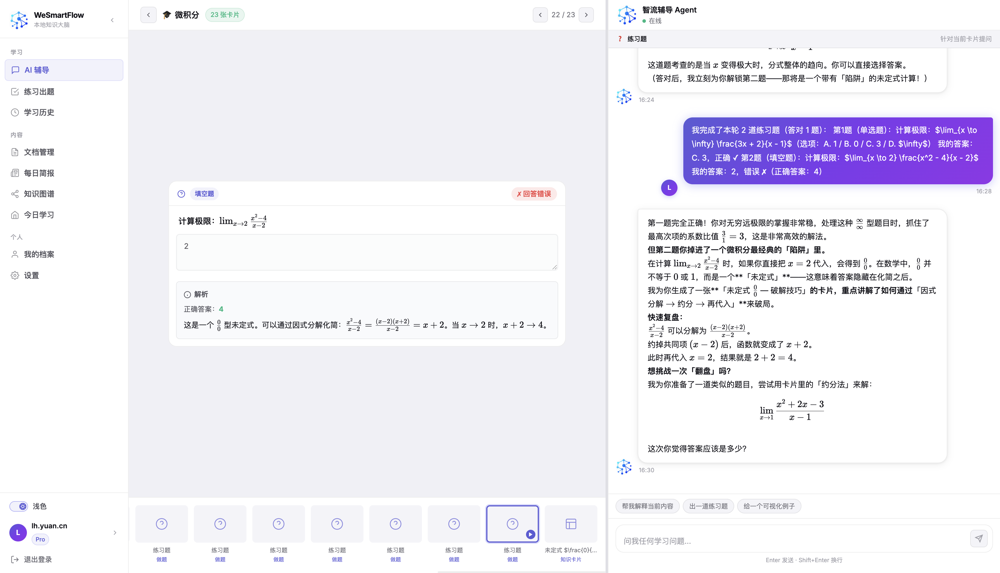
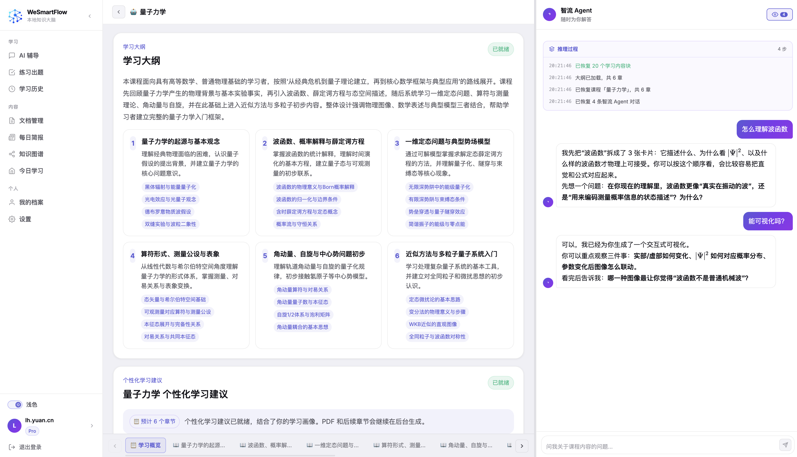
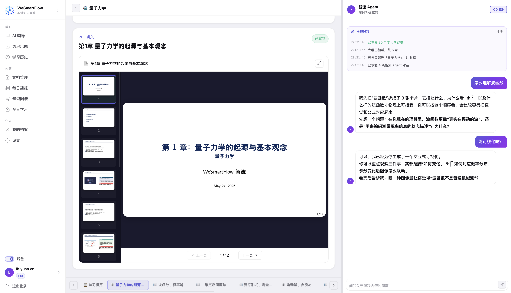
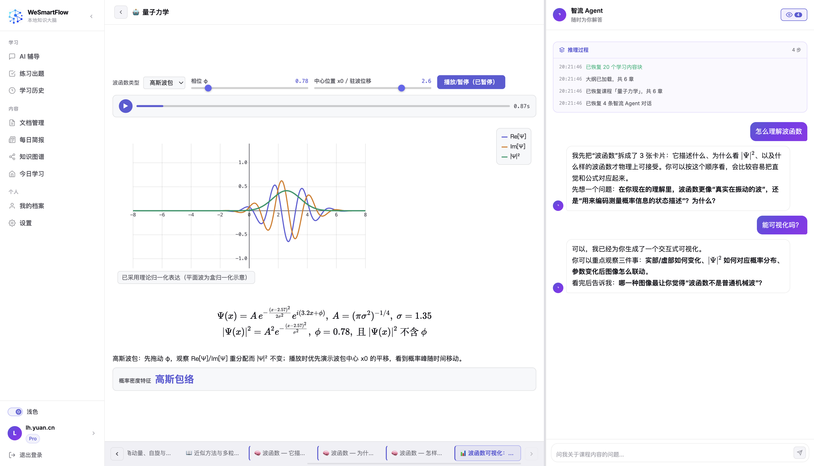
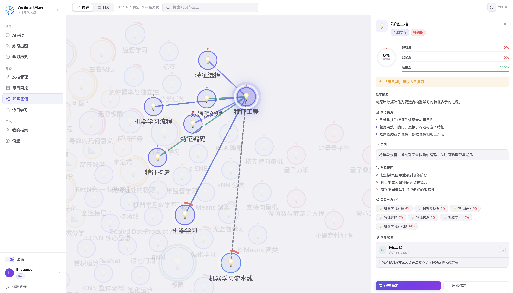
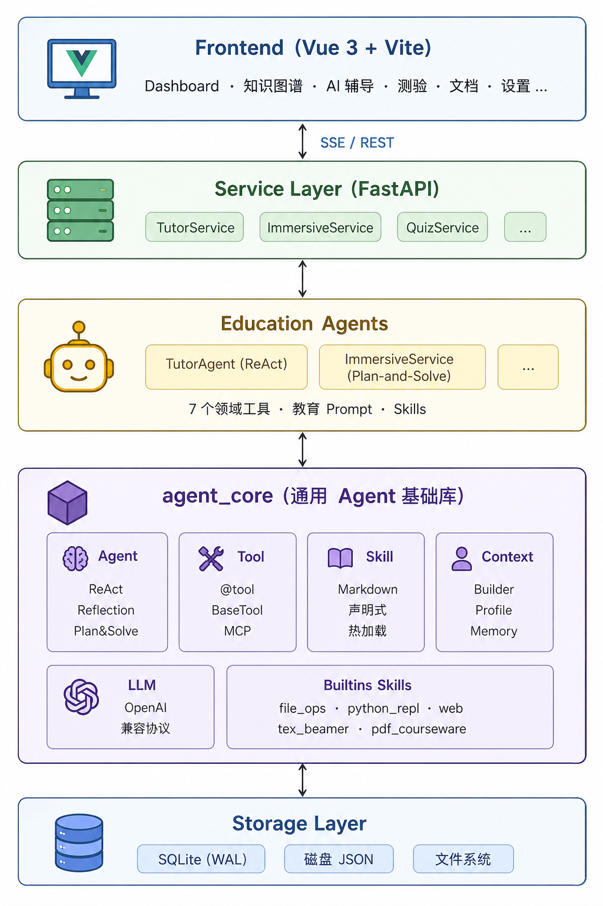

<div align="center">

# WeSmartFlow

**Agent-native 自适应学习框架，让 AI 真正理解学习过程**

[](https://www.python.org/downloads/)
[](https://vuejs.org/)
[](https://fastapi.tiangolo.com/)
[](./LICENSE)

🌐 [wesmartflow.cn](http://wesmartflow.cn)

**[English](./README_EN.md) | 中文**

AI Agent 不只是回答问题——<br/>
它承担知识诊断、路径规划、个性化辅导、内容生成、测验反馈与长期记忆演化。

[项目介绍](#-项目介绍) · [功能展示](#-功能展示) · [核心能力](#-核心能力) · [快速开始](#-快速开始) · [项目结构](#-项目结构) · [路线图](#-路线图)

</div>

---

## 📌 项目介绍

**WeSmartFlow** 是一套 Agent-native 自适应学习框架，探索 AI Agent 如何从简单问答深入到真实学习过程的建模与优化。

### 为什么不是又一个 AI 学习助手？

大量 AI 学习类项目仍停留在"聊天助手"或"内容生成器"阶段——本质是 Chatbot + Prompt，能力局限于回答问题或生成材料，缺少对**学习过程本身**的建模，也缺少对学习状态、知识结构和反馈闭环的持续追踪。

WeSmartFlow 的核心价值在于提供一套面向教育场景的 **Agent 工程框架**，将 ReAct、Reflection、Graph Memory、Tool Use、Multi-Agent Collaboration 等能力有机结合，使 Agent 能够：

- **理解学习目标** — 不只是回答问题，而是感知学习者当前所处阶段
- **追踪学习状态** — 通过知识图谱持续记录掌握程度、概念关系与复习节奏
- **沉淀知识资产** — 将学习行为转化为可持续演化的结构化资产
- **在反馈中进化** — 根据测验结果和学习表现持续优化学习策略

## 📱 功能展示

### 💬 AI 辅导 — 开始学习，两种模式供你选择

<p align="center">
  
</p>

### 💬 AI 辅导 — 自由对话，讲解、交互、做题，让知识更加清晰

<p align="center">
  
  
  
</p>

### 💬 AI 辅导 — 沉浸课程，大纲、课件、问答，使学习更加深入

<p align="center">
  
  
  
</p>

### 🕸️ 知识图谱 — 知识结构与掌握详情

<p align="center">
  
</p>

## 🎯 核心能力

### 一、ReAct Agent 个性化辅导

> Agent 的输出不只是文本回复，而是会**真实改变学习者的长期知识状态**。

辅导 Agent 基于 ReAct 模式，在推理过程中自主调用教育工具：

| 工具能力 | 说明 |
|---------|------|
| 知识节点创建 | 识别新概念，自动创建图谱节点并建立关联 |
| 知识节点更新 | 补充已有节点的描述、标签、关联关系 |
| 掌握度更新 | 根据对话表现实时更新三维掌握度（理解 × 记忆 × 连接） |
| HTML 知识卡片 | 生成精美的 HTML 交互式知识卡片 |
| 交互式可视化 | 基于 EduViz SDK 生成可交互的教学可视化（沙盒运行） |
| 测验题生成 | 4 种题型（单选 / 填空 / 判断 / 开放题）即时出题 |
| 图谱检索 | 搜索已有知识节点，避免重复并建立连接 |
| Web 搜索 | Tavily / arXiv / DuckDuckGo 多源搜索补充资料 |
| 语音讲解 | macOS TTS 生成音频讲解 |

### 二、Graph Memory 个人知识图谱

> 学习过程具备**长期记忆和持续优化能力**，而不是每次对话从零开始。

- **三维掌握度模型** — 理解（comprehension）× 记忆（retention）× 连接（connection）
- **五种边关系** — prerequisite / related / part_of / leads_to / contrasts
- **SM-2 间隔重复** — 基于 `ease_factor` / `interval` / `repetitions` 的智能复习调度
- **跨场景共享** — 交互式辅导与沉浸式课程共享同一张图谱
- **用户画像记忆** — 对话结束后 LLM 自动提取用户信息，跨会话持久化

### 三、Multi-Agent Workflow 学习内容生成

> 从学习主题到完整课件包的**全自动编排**。

```
输入：一个学习主题
  │
  ├── 📋 规划 Agent → 拆解为多章节大纲
  ├── 🔍 研究 Agent → 每章节独立搜索资料
  ├── ✍️ 撰写 Agent → 生成 Beamer LaTeX 课件
  ├── 🖼️ 插图 Agent → AI 生成配图
  ├── 🔊 语音 Agent → TTS 生成音频讲解
  └── 📝 出题 Agent → 每章节配套练习
  │
输出：多章节 PDF + 音频 + 练习 + 图谱节点
```

### 四、EduViz 交互式可视化

> 让抽象概念变得**可触摸、可操作**。

Agent 可自主生成基于 EduViz SDK 的交互式可视化，支持多种教学模式：

- **算法步骤演示** — 逐步动画展示算法执行过程
- **公式分解** — 交互式拆解复杂公式
- **参数探索** — 滑块调参实时观察变化
- **几何构造** — 动态几何图形交互
- **状态对比** — 前后状态可视化对比
- **时间演化** — 时间轴动画展示变化过程

## 🏗️ 架构设计

<p align="center">
  
</p>

本仓库包含三层，各层有独立的 README 文档：

| 层级 | 路径 | 说明 | 文档 |
|------|------|------|------|
| Agent 基础库 | `backend/agent_core/` | 通用 Agent 框架，可独立复用 | [README](./backend/agent_core/README.md) |
| 后端服务 | `backend/` | FastAPI 业务服务 | [README](./backend/README.md) |
| 前端应用 | `frontend/` | Vue 3 单页应用 | [README](./frontend/README.md) |

## 🚀 快速开始

### 环境要求

| 依赖 | 版本 | 说明 | 必须 |
|------|------|------|:----:|
| [Python](https://www.python.org/) | ≥ 3.10 | 后端运行时 | ✅ |
| [Node.js](https://nodejs.org/) | ≥ 18 | 前端构建 | ✅ |
| [XeLaTeX + latexmk](https://tug.org/texlive/) | TeX Live 2023+ | 编译 Beamer 课件（沉浸模式） | 可选 |
| [SimplePlus Beamer 主题](https://github.com/pm25/SimplePlus-BeamerTheme) | master | Beamer 课件主题 | 可选 |
| macOS `say` + Tingting | macOS 13+ | TTS 语音讲解（非 macOS 自动降级） | 可选 |

你还需要一个 **OpenAI 兼容 API Key**（OpenAI / DeepSeek / 通义千问等均可）。

### 安装与启动

**1. 克隆仓库并安装依赖**

```bash
git clone https://github.com/Tencent/WeSmartFlow.git
cd WeSmartFlow

# 推荐使用 Conda 统一管理
conda env create -f environment.yml && conda activate edu-agent

# 安装后端依赖
pip install -r backend/requirements.txt

# 安装前端依赖
cd frontend && npm install && cd ..
```

**2. 安装 LaTeX（可选，仅沉浸式课件需要）**

```bash
# macOS
brew install --cask mactex-no-gui

# Ubuntu / Debian
sudo apt install texlive-xetex texlive-latex-extra texlive-fonts-extra \
                 texlive-lang-chinese latexmk

# 验证
xelatex --version && latexmk --version
```

**3. 下载 Beamer 主题（可选）**

```bash
git clone https://github.com/pm25/SimplePlus-BeamerTheme.git backend/SimplePlus-BeamerTheme
```

**4. 配置环境变量**

```bash
cp backend/.env.example backend/.env
```

编辑 `backend/.env`，至少填写：

| 变量 | 说明 | 必填 |
|------|------|:----:|
| `LLM_API_KEY` | LLM API 密钥 | ✅ |
| `LLM_BASE_URL` | LLM API 端点 | ✅ |
| `LLM_MODEL` | 模型名称 | ✅ |
| `TAVILY_API_KEY` | Web 搜索 API | 可选 |
| `IMG_API_KEY` | 图像生成 API | 可选 |
| `GITHUB_CLIENT_ID` | GitHub OAuth 登录 | 可选 |
| `SMTP_HOST` / `SMTP_USER` | 邮箱验证码登录 | 可选 |

> 完整环境变量说明见 [后端 README](./backend/README.md#环境变量)

**5. 启动服务**

```bash
# 后端（端口 8080）
cd backend && python main.py

# 前端（端口 5173，另开终端）
cd frontend && npm run dev
```

启动成功后浏览器访问 **http://localhost:5173** 即可使用。

## 🧩 项目结构

```
WeSmartFlow/
├── backend/
│   ├── agent_core/          # 通用 Agent 基础库（可独立复用）
│   │   ├── agent/           #   推理范式：ReAct / Reflection / Plan-and-Solve
│   │   ├── tool/            #   工具系统：@tool / BaseTool / MCP / Agent-as-Tool
│   │   ├── skills/          #   Markdown 声明式技能加载器
│   │   ├── context/         #   上下文构建器（Profile + Skill Prompt）
│   │   ├── memory/          #   用户画像记忆
│   │   ├── llm/             #   LLM 适配层（OpenAI 兼容协议）
│   │   └── builtins/        #   内置技能与工具
│   ├── agents/              # 教育领域 Agent 与工具
│   │   ├── tools/           #   教育工具（知识图谱 / 卡片 / 可视化 / 测验）
│   │   └── prompts/         #   Agent 提示词与技能定义
│   ├── services/            # 业务服务层
│   │   └── immersive/       #   沉浸式课程服务（Multi-Agent）
│   ├── routers/             # FastAPI 路由
│   ├── repositories/        # 数据访问层
│   ├── models/              # Pydantic 数据模型
│   └── main.py              # 应用入口
├── frontend/
│   ├── src/
│   │   ├── views/           # 页面视图（Chat / Immersive / Graph / Quiz / ...）
│   │   ├── components/      # 可复用组件
│   │   │   ├── EduViz/      #   交互式可视化沙盒
│   │   │   ├── HtmlCard/    #   HTML 知识卡片渲染
│   │   │   ├── QuizCard/    #   测验卡片
│   │   │   └── VizCard/     #   可视化卡片
│   │   ├── api/             # API 客户端（含 SSE 流式）
│   │   └── composables/     # Vue 组合式函数
│   └── package.json
├── environment.yml          # Conda 环境定义
└── README.md                # 本文件
```

## 🗺️ 路线图

| 状态 | 方向 | 说明 |
|:----:|------|------|
| ✅ | **交互式可视化** | EduViz SDK 沙盒渲染教学可视化 |
| ✅ | **多登录方式** | GitHub OAuth · 邮箱验证码 · 微信小程序 |
| ✅ | **HTML 知识卡片** | 替代 LaTeX 卡片，更轻量、更美观 |
| ✅ | **用量配额管理** | 免费额度控制（LLM / 搜索 / 图片） |
| 🎯 | **Agent Benchmark** | 围绕教育任务建设评测体系 |
| 🎯 | **Reflection 反馈调整** | 围绕学习表现和测验结果进行反思 |
| 🎯 | **更多推理范式** | Tree-of-Thought · LATS · 自定义范式 |
| 🎯 | **多 Agent 并行** | `as_tool()` 并行 fan-out + reduce |
| 🔜 | **MCP 工具接入** | 外部题库、知识库的标准化接入 |
| 🔜 | **向量记忆** | 引入向量存储实现语义检索式记忆 |
| 🔜 | **三层记忆** | 短期 → 中期 → 长期 |
| 🔜 | **可观测性** | Agent 执行链路追踪 · token 用量仪表盘 |
| 🔜 | **多模型路由** | 按任务复杂度自动选择模型 |
| 📋 | **生产级存储** | PostgreSQL · S3 · 向量数据库 |
| 📋 | **容器化部署** | Docker Compose · K8s |

## 🔧 技术栈

| 层级 | 技术 |
|------|------|
| 前端 | Vue 3 · Vue Router 4 · Vite 8 · pdfjs-dist · marked · KaTeX · DOMPurify · pdf-lib |
| 后端 | FastAPI · SQLite（WAL）· SSE-Starlette · Pydantic · uvicorn · tiktoken |
| Agent 基础库 | `agent_core` 自研 · ReAct / Reflection / Plan-and-Solve · `@tool` · Agent-as-Tool · MCP |
| LLM | OpenAI 兼容协议（支持任意兼容网关） |
| 内容生成 | HTML 知识卡片 · EduViz 交互式可视化 · XeLaTeX + Beamer (SimplePlus) · macOS `say` (Tingting) |
| 搜索 | Tavily · arXiv · DuckDuckGo |
| 图像 | OpenAI 兼容图像接口 |
| 文档解析 | pdfplumber · pdfminer |
| 认证 | GitHub OAuth · 邮箱验证码 · 微信小程序 · JWT |

## 📄 许可证

本项目基于 [MIT](./LICENSE) 协议发布。
