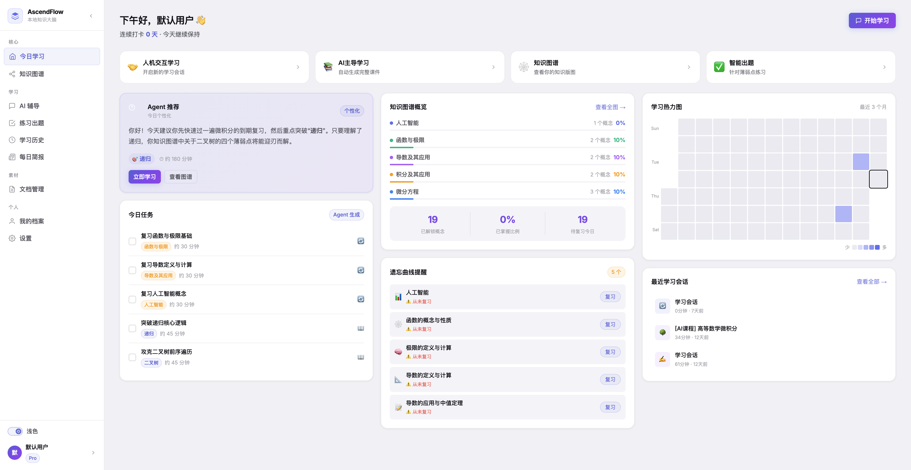
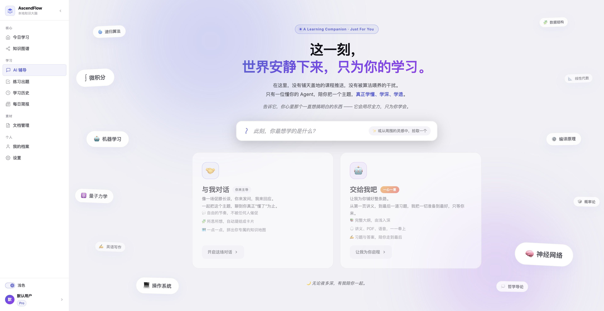
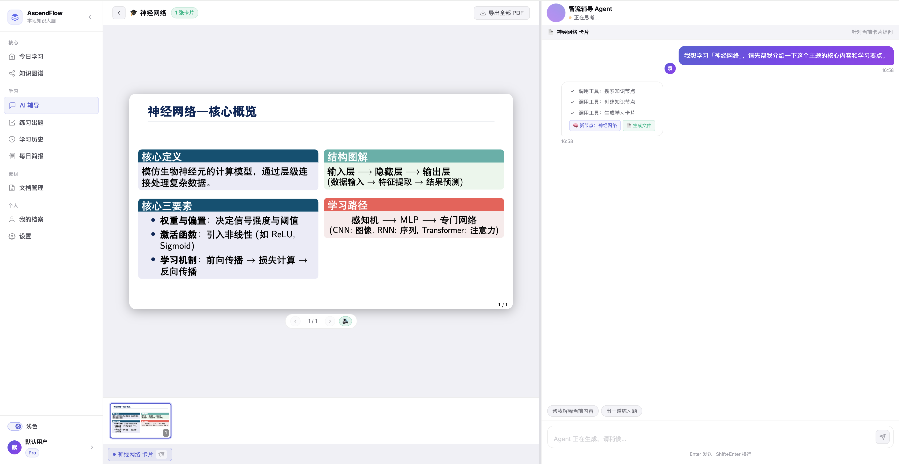
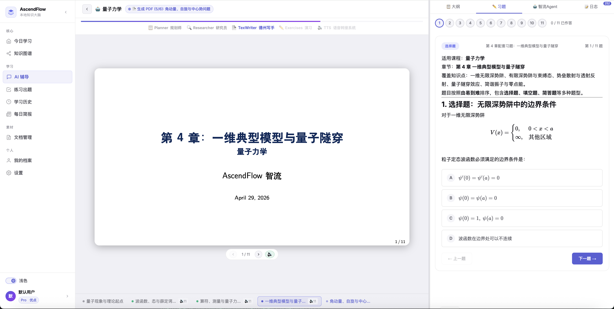
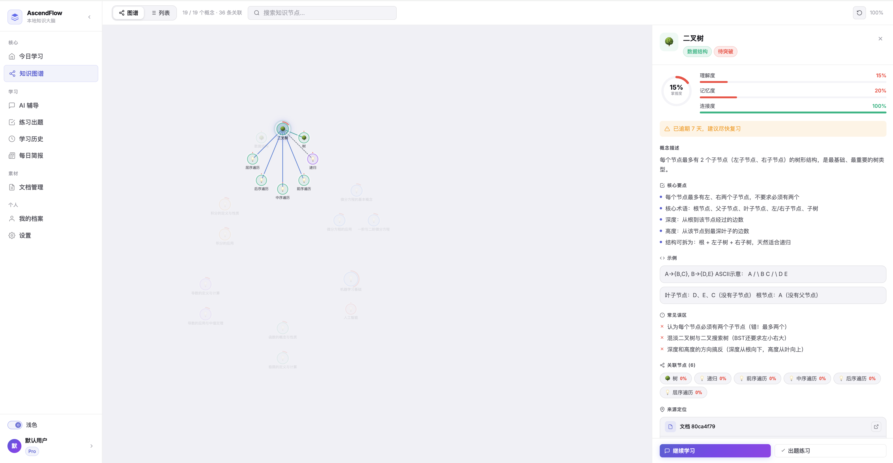

<div align="center">

# WeSmartFlow

**Agent-native Adaptive Learning Framework — Let AI Truly Understand the Learning Process**

[](https://www.python.org/downloads/)
[](https://vuejs.org/)
[](https://fastapi.tiangolo.com/)
[](./LICENSE)

🌐 [wesmartflow.cn](http://wesmartflow.cn) *(coming soon)*

**English | [中文](./README.md)**

AI Agents do more than answer questions —<br/>
they perform knowledge diagnosis, path planning, personalized tutoring, content generation, quiz feedback, and long-term memory evolution.

[Introduction](#-introduction) · [Screenshots](#-screenshots) · [Core Capabilities](#-core-capabilities) · [Getting Started](#-getting-started) · [Project Structure](#-project-structure) · [Roadmap](#-roadmap)

</div>

---

## 📌 Introduction

**WeSmartFlow** is an Agent-native adaptive learning framework that explores how AI Agents can go beyond simple Q&A to model and optimize real learning processes.

### Why Not Just Another AI Learning Assistant?

Most AI learning projects remain at the "chatbot" or "content generator" stage — essentially Chatbot + Prompt, limited to answering questions or generating materials. They lack modeling of **the learning process itself**, and fail to continuously track learning states, knowledge structures, and feedback loops.

WeSmartFlow's core value lies in providing an **Agent engineering framework** for educational scenarios, organically combining ReAct, Reflection, Graph Memory, Tool Use, and Multi-Agent Collaboration to enable Agents to:

- **Understand learning goals** — Not just answering questions, but perceiving the learner's current stage
- **Track learning states** — Continuously recording mastery levels, concept relationships, and review rhythms via knowledge graphs
- **Accumulate knowledge assets** — Transforming learning behaviors into continuously evolving structured assets
- **Evolve through feedback** — Continuously optimizing learning strategies based on quiz results and learning performance

## 📱 Screenshots

### 📊 Today's Learning — Personalized Study Plan & Heatmap



### 💬 AI Tutoring — Start Learning



### 💬 AI Tutoring — Interactive Learning with Real-time Card Generation & Knowledge Graph Updates



### 💬 AI Tutoring — Immersive Learning with One-shot Material Generation & Knowledge Node Creation



### 🕸️ Knowledge Graph — Node Details & Mastery Levels



## 🎯 Core Capabilities

### 1. ReAct Agent for Personalized Tutoring

> The Agent's output is not just text — it **genuinely changes the learner's long-term knowledge state**.

The tutoring Agent uses the ReAct paradigm, autonomously invoking educational tools during reasoning:

| Tool | Description |
|------|-------------|
| Knowledge Node Creation | Identifies new concepts, auto-creates graph nodes and establishes connections |
| Mastery Update | Real-time 3D mastery updates based on conversation performance (comprehension × retention × connection) |
| Knowledge Card Generation | XeLaTeX + Beamer compiled PDF knowledge cards |
| Quiz Generation | 4 question types (MCQ / fill-in-the-blank / true-false / open-ended) for instant assessment |
| Graph Search | Searches existing knowledge nodes to avoid duplication and build connections |
| Web Search | Tavily / arXiv / DuckDuckGo multi-source search for supplementary materials |
| Voice Explanation | macOS TTS audio explanations |

### 2. Graph Memory — Personal Knowledge Graph

> The learning process has **long-term memory and continuous optimization**, rather than starting from scratch each conversation.

- **3D Mastery Model** — Comprehension × Retention × Connection
- **Five Edge Types** — prerequisite / related / part_of / leads_to / contrasts
- **SM-2 Spaced Repetition** — Intelligent review scheduling based on `ease_factor` / `interval` / `repetitions`
- **Cross-scenario Sharing** — Interactive tutoring and immersive courses share the same graph
- **User Profile Memory** — LLM auto-extracts user information after conversations, persisted across sessions

### 3. Multi-Agent Workflow for Content Generation

> From a learning topic to a complete courseware package — **fully automated orchestration**.

```
Input: A learning topic
  │
  ├── 📋 Planning Agent → Breaks down into multi-chapter outline
  ├── 🔍 Research Agent → Independent research per chapter
  ├── ✍️ Writing Agent → Generates Beamer LaTeX slides
  ├── 🖼️ Illustration Agent → AI-generated images
  ├── 🔊 Voice Agent → TTS audio explanations
  └── 📝 Quiz Agent → Practice exercises per chapter
  │
Output: Multi-chapter PDF + Audio + Exercises + Graph Nodes
```

## 🏗️ Architecture


This repository contains three layers, each with its own README:

| Layer | Path | Description | Docs |
|-------|------|-------------|------|
| Agent Core Library | `backend/agent_core/` | General-purpose Agent framework, independently reusable | [README](./backend/agent_core/README_EN.md) |
| Backend Service | `backend/` | FastAPI business service | [README](./backend/README_EN.md) |
| Frontend App | `frontend/` | Vue 3 SPA | [README](./frontend/README_EN.md) |

## 🚀 Getting Started

### Prerequisites

| Dependency | Version | Description | Required |
|------------|---------|-------------|:--------:|
| [Python](https://www.python.org/) | ≥ 3.10 | Backend runtime | ✅ |
| [Node.js](https://nodejs.org/) | ≥ 18 | Frontend build | ✅ |
| [XeLaTeX + latexmk](https://tug.org/texlive/) | TeX Live 2023+ | Compile Beamer knowledge cards & slides | ✅ |
| [SimplePlus Beamer Theme](https://github.com/pm25/SimplePlus-BeamerTheme) | master | Beamer slide theme | ✅ |
| macOS `say` + Tingting | macOS 13+ | TTS voice (auto-degrades on non-macOS) | Optional |

You also need an **OpenAI-compatible API Key** (OpenAI / DeepSeek / Qwen, etc.).

### Installation & Launch

**1. Clone the repository and install dependencies**

```bash
git clone https://github.com/your-org/WeSmartFlow.git
cd WeSmartFlow

# Recommended: use Conda for unified management
conda env create -f environment.yml && conda activate agent

# Install backend dependencies
pip install -r backend/requirements.txt

# Install frontend dependencies
cd frontend && npm install && cd ..
```

**2. Install LaTeX**

```bash
# macOS
brew install --cask mactex-no-gui

# Ubuntu / Debian
sudo apt install texlive-xetex texlive-latex-extra texlive-fonts-extra \
                 texlive-lang-chinese latexmk

# Verify
xelatex --version && latexmk --version
```

**3. Download Beamer Theme**

```bash
git clone https://github.com/pm25/SimplePlus-BeamerTheme.git backend/SimplePlus-BeamerTheme
```

**4. Configure Environment Variables**

```bash
cp backend/.env.example backend/.env
```

Edit `backend/.env`, fill in at minimum:

| Variable | Description | Required |
|----------|-------------|:--------:|
| `OPENAI_API_KEY` | LLM API key | ✅ |
| `OPENAI_BASE_URL` | LLM API endpoint | ✅ |
| `LLM_MODEL` | Model name | ✅ |
| `TAVILY_API_KEY` | Web search API | Optional |
| `IMG_API_KEY` | Image generation API | Optional |

> Full environment variable documentation in [Backend README](./backend/README_EN.md#environment-variables)

**5. Start Services**

```bash
# Backend (port 8080)
cd backend && python main.py

# Frontend (port 5173, in another terminal)
cd frontend && npm run dev
```

Once started, visit **http://localhost:5173** in your browser.

## 🧩 Project Structure

```
WeSmartFlow/
├── backend/
│   ├── agent_core/          # General-purpose Agent core library (independently reusable)
│   │   ├── agent/           #   Reasoning paradigms: ReAct / Reflection / Plan-and-Solve
│   │   ├── tool/            #   Tool system: @tool / BaseTool / MCP / Agent-as-Tool
│   │   ├── skills/          #   Markdown declarative skill loader
│   │   ├── context/         #   Context builder
│   │   ├── memory/          #   User profile memory
│   │   ├── llm/             #   LLM adapter layer
│   │   └── builtins/        #   Built-in skills & tools
│   ├── agents/              # Education-domain Agents & tools
│   ├── services/            # Business service layer
│   ├── routers/             # FastAPI routes
│   ├── repositories/        # Data access layer
│   ├── models/              # Pydantic data models
│   └── main.py              # Application entry point
├── frontend/
│   ├── src/
│   │   ├── views/           # Page views
│   │   ├── api/             # API client (with SSE)
│   │   └── composables/     # Vue composables
│   └── package.json
├── environment.yml          # Conda environment definition
└── README.md                # This file (product documentation)
```

## 🗺️ Roadmap

| Status | Direction | Description |
|:------:|-----------|-------------|
| 🎯 | **Agent Benchmark** | Build evaluation system around educational tasks |
| 🎯 | **Reflection & Adjustment** | Reflect on learning performance and quiz results |
| 🎯 | **More Reasoning Paradigms** | Tree-of-Thought · LATS · Custom paradigms |
| 🎯 | **Multi-Agent Parallelism** | `as_tool()` parallel fan-out + reduce |
| 🔜 | **MCP Tool Integration** | Standardized access to external question banks & knowledge bases |
| 🔜 | **Vector Memory** | Introduce vector storage for semantic retrieval memory |
| 🔜 | **Three-tier Memory** | Short-term → Mid-term → Long-term |
| 🔜 | **Observability** | Agent execution tracing · Token usage dashboard |
| 🔜 | **Multi-model Routing** | Auto-select models based on task complexity |
| 📋 | **Production Storage** | PostgreSQL · S3 · Vector databases |
| 📋 | **Containerized Deployment** | Docker Compose · K8s |

## 🔧 Tech Stack

| Layer | Technologies |
|-------|-------------|
| Frontend | Vue 3 · Vue Router 4 · Vite 8 · pdfjs-dist · marked · KaTeX · pdf-lib |
| Backend | FastAPI · SQLite (WAL) · SSE-Starlette · Pydantic · uvicorn |
| Agent Core | `agent_core` (custom) · ReAct / Reflection / Plan-and-Solve · `@tool` · Agent-as-Tool · MCP |
| LLM | OpenAI-compatible protocol (replaceable with any compatible gateway) |
| Content Generation | XeLaTeX + Beamer (SimplePlus) · macOS `say` (Tingting) |
| Search | Tavily · arXiv · DuckDuckGo |
| Image | OpenAI-compatible image API |
| Document Parsing | pdfplumber · pdfminer |

## 📄 License

This project is released under the [MIT](./LICENSE) license.
